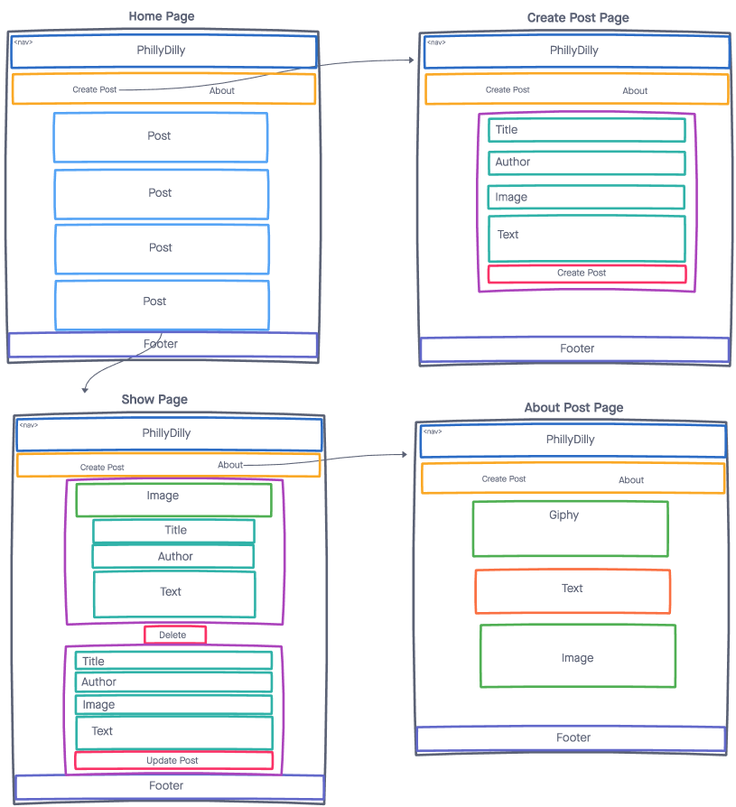

# PhillyDilly - Project 3

This app allows users to create, read, update, and delete posts about the Philadelphia Eagles or Philly Cheeseteaks. Users input an image of the whatever they want, title, their name, and text for the post. Users can also click on "About" to see what the website is about and its origins.

## Technologoies Used
- MongoDB/Mongoose
- Express
- ReactJS
- Node

## Screenshots:
These screenshots show a quick sketch of what the app looks while the user navigates through it.

## Getting Started:
[Click here](https://phillydilly.netlify.app/) to check the app out!

## Future Enhacements:
Have user authentication.